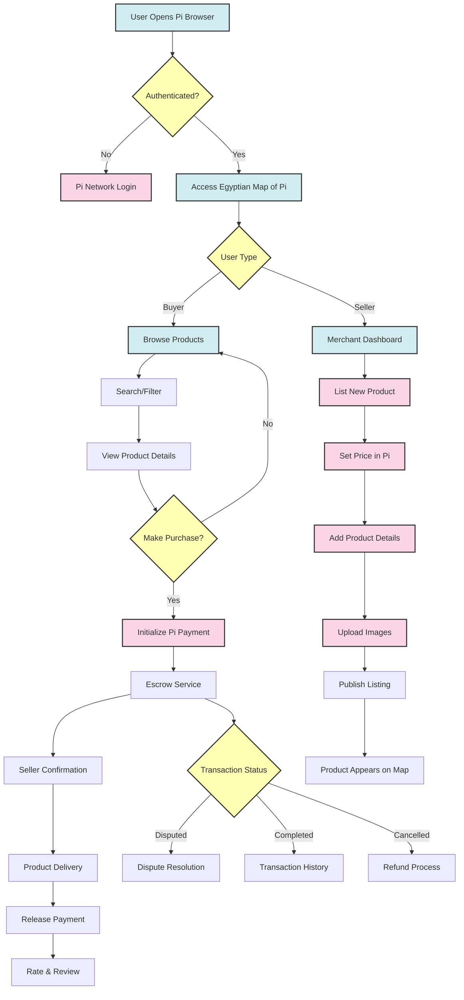
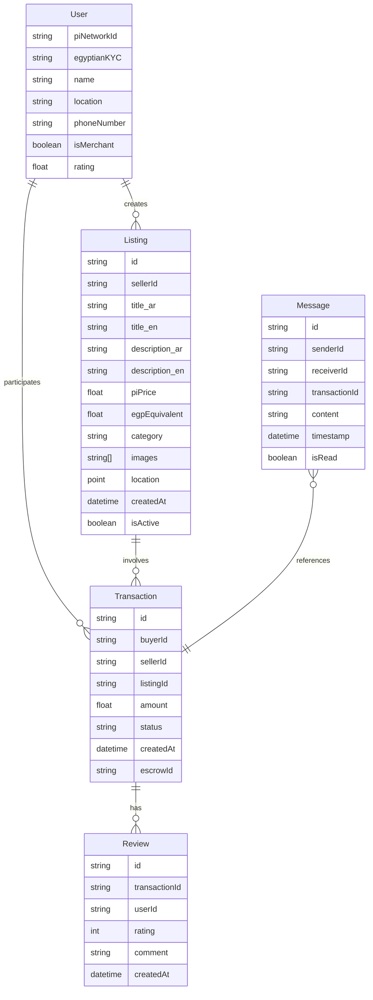
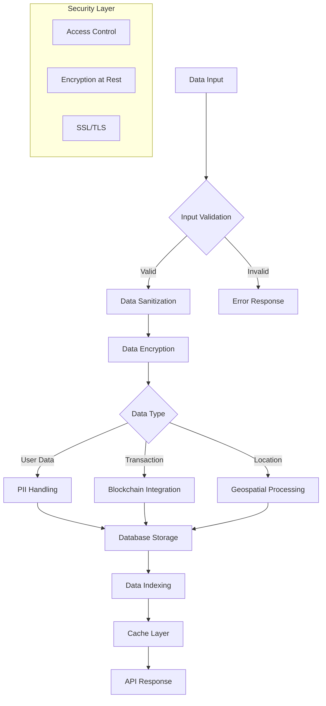
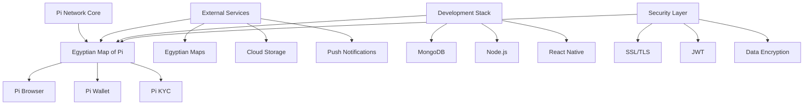

# Product Requirements Document (PRD)

# 1. INTRODUCTION

## 1.1 Purpose
This Product Requirements Document (PRD) specifies the requirements for developing the Egyptian Map of Pi application, a localized marketplace platform within the Pi Network ecosystem. This document serves as a comprehensive guide for developers, project managers, stakeholders, and quality assurance teams involved in the development and implementation of the Egyptian Map of Pi application.

## 1.2 Scope
The Egyptian Map of Pi is a specialized marketplace application designed to connect local Egyptian merchants and buyers within the Pi Network ecosystem. The system will:

- Provide a dedicated platform for Egyptian pioneers to list and discover local products and services
- Enable secure Pi cryptocurrency transactions between Egyptian buyers and sellers
- Integrate with the Pi Browser and Pi Wallet for seamless payment processing
- Implement location-based services to facilitate local commerce in Egypt
- Support Arabic language interface for better accessibility
- Include Egypt-specific categories and product classifications
- Incorporate local payment methods and trading practices

The application aims to foster economic growth within Egypt's Pi Network community by providing a trusted platform for local commerce while maintaining compliance with both Pi Network protocols and Egyptian regulations.

# 2. PRODUCT DESCRIPTION

## 2.1 Product Perspective
The Egyptian Map of Pi operates as a specialized regional implementation within the broader Pi Network ecosystem, integrating with:

- Pi Browser for secure access and authentication
- Pi Wallet for transaction processing
- Pi Network's KYC verification system
- Pi Network's mainnet blockchain infrastructure
- Pi Platform APIs for core functionality

The application serves as a bridge between the global Pi Network and Egypt's local commerce environment, requiring compatibility with:
- Egyptian mobile networks and internet infrastructure
- Local device specifications common in the Egyptian market
- Regional mapping services for location-based features

## 2.2 Product Functions
The Egyptian Map of Pi provides the following core functions:

- User Registration and Authentication
  - Pi Network account integration
  - Egyptian KYC verification
  - Merchant verification system

- Marketplace Operations
  - Product/service listing creation and management
  - Category-based browsing and search
  - Location-based discovery
  - Real-time Pi price conversion to EGP

- Transaction Management
  - Secure Pi wallet integration
  - Escrow service for purchases
  - Transaction history tracking
  - Dispute resolution system

- Communication Features
  - In-app messaging between buyers and sellers
  - Push notifications for transactions
  - Rating and review system

## 2.3 User Characteristics
Primary user groups include:

1. Egyptian Merchants
   - Small business owners
   - Individual sellers
   - Service providers
   - Technical proficiency: Basic to intermediate
   - Language preference: Primarily Arabic
   - Age range: 21-50 years

2. Egyptian Buyers
   - Pi Network pioneers
   - Regular consumers
   - Technical proficiency: Basic
   - Language preference: Arabic/English
   - Age range: 18-45 years

## 2.4 Constraints
1. Technical Constraints
   - Must operate within Pi Browser limitations
   - Compatible with Android 6.0+ and iOS 12.0+
   - Maximum file size for product images: 5MB
   - Bandwidth optimization for varying internet speeds

2. Regulatory Constraints
   - Compliance with Egyptian e-commerce laws
   - Pi Network's marketplace guidelines
   - Data protection requirements
   - Digital payment regulations

3. Business Constraints
   - Initial launch limited to Egyptian market
   - Transaction limits based on Pi Network policies
   - Resource limitations for customer support

## 2.5 Assumptions and Dependencies
Assumptions:
- Stable internet connectivity in major Egyptian cities
- Users have basic smartphone literacy
- Merchants have access to digital photography tools
- Users maintain valid Pi Network accounts

Dependencies:
- Pi Network's mainnet stability
- Pi Browser API availability
- Egyptian regulatory environment
- Local payment processing systems
- Third-party mapping services
- Mobile device GPS accuracy
- Pi Network KYC verification system

# 3. PROCESS FLOWCHART

# 4. FUNCTIONAL REQUIREMENTS

## 4.1 User Authentication and Profile Management

| ID | Description | Priority |
|---|---|---|
| AUTH-01 | Integration with Pi Network authentication system via Pi Browser | High |
| AUTH-02 | Egyptian KYC verification status display and management | High |
| AUTH-03 | User profile creation with mandatory Egyptian location data | High |
| AUTH-04 | Merchant verification and business profile setup | High |
| AUTH-05 | Profile settings management (language, notifications, privacy) | Medium |

## 4.2 Marketplace Listing Management

| ID | Description | Priority |
|---|---|---|
| LIST-01 | Create product/service listings with Arabic/English descriptions | High |
| LIST-02 | Upload multiple product images (max 5MB per image) | High |
| LIST-03 | Set prices in Pi with automatic EGP conversion display | High |
| LIST-04 | Categorize listings according to Egyptian market segments | High |
| LIST-05 | Manage listing visibility and availability status | Medium |
| LIST-06 | Bulk listing management for merchants | Low |

## 4.3 Search and Discovery

| ID | Description | Priority |
|---|---|---|
| SRCH-01 | Location-based product/service discovery within Egypt | High |
| SRCH-02 | Category and subcategory browsing system | High |
| SRCH-03 | Advanced search with filters (price, location, rating) | High |
| SRCH-04 | Arabic/English search capability | High |
| SRCH-05 | Save favorite searches and listings | Medium |

## 4.4 Transaction Processing

| ID | Description | Priority |
|---|---|---|
| TRANS-01 | Secure Pi wallet integration for payments | High |
| TRANS-02 | Escrow service for transaction protection | High |
| TRANS-03 | Order status tracking and updates | High |
| TRANS-04 | Transaction history and receipt generation | High |
| TRANS-05 | Automated refund processing | Medium |

## 4.5 Communication System

| ID | Description | Priority |
|---|---|---|
| COMM-01 | In-app messaging between buyers and sellers | High |
| COMM-02 | Push notifications for orders and messages | High |
| COMM-03 | Rating and review system for transactions | High |
| COMM-04 | Dispute resolution communication channel | High |
| COMM-05 | Automated transaction status notifications | Medium |

## 4.6 Location Services

| ID | Description | Priority |
|---|---|---|
| LOC-01 | Integration with Egyptian mapping services | High |
| LOC-02 | Real-time location tracking for delivery | High |
| LOC-03 | Geofencing for regional market segregation | Medium |
| LOC-04 | Distance calculation between buyer and seller | Medium |
| LOC-05 | Location-based merchant discovery | High |

## 4.7 Analytics and Reporting

| ID | Description | Priority |
|---|---|---|
| ANLY-01 | Transaction history reports | High |
| ANLY-02 | Merchant performance metrics | Medium |
| ANLY-03 | Market trend analysis | Low |
| ANLY-04 | User behavior tracking | Medium |
| ANLY-05 | Sales and revenue reporting | Medium |

## 4.8 Security and Compliance

| ID | Description | Priority |
|---|---|---|
| SEC-01 | Compliance with Egyptian e-commerce regulations | High |
| SEC-02 | Data encryption for user information | High |
| SEC-03 | Fraud detection system | High |
| SEC-04 | Transaction verification protocols | High |
| SEC-05 | Secure data backup and recovery | High |

# 5. NON-FUNCTIONAL REQUIREMENTS

## 5.1 Performance Requirements

| Requirement | Description | Target Metric |
|------------|-------------|---------------|
| Response Time | Maximum time for page loads | < 3 seconds |
| API Response | Maximum time for API calls | < 1 second |
| Image Loading | Product image loading time | < 2 seconds |
| Transaction Processing | Payment processing time | < 5 seconds |
| Concurrent Users | Simultaneous active users supported | 10,000+ |
| Database Queries | Query execution time | < 500ms |
| Map Rendering | Location data rendering time | < 2 seconds |

## 5.2 Safety Requirements

| Requirement | Description |
|------------|-------------|
| Data Backup | Automated daily backups with 30-day retention |
| Failure Recovery | System recovery time < 4 hours |
| Transaction Rollback | Automatic rollback for failed transactions |
| Error Logging | Comprehensive error tracking and logging |
| Redundancy | Geographic data redundancy across multiple zones |
| Fault Tolerance | Graceful degradation of non-critical features |
| Emergency Shutdown | Controlled shutdown procedures for critical failures |

## 5.3 Security Requirements

| Requirement | Description |
|------------|-------------|
| Authentication | Multi-factor authentication via Pi Network |
| Data Encryption | AES-256 encryption for data at rest and in transit |
| Session Management | 30-minute session timeout with automatic logout |
| Access Control | Role-based access control (RBAC) system |
| API Security | OAuth 2.0 implementation for API access |
| Audit Logging | Comprehensive security event logging |
| Vulnerability Scanning | Weekly automated security scans |

## 5.4 Quality Requirements

### 5.4.1 Availability
- System uptime: 99.9%
- Planned maintenance windows: 2AM-4AM EET
- Maximum unplanned downtime: 1 hour/month

### 5.4.2 Maintainability
- Modular architecture for easy updates
- Automated deployment pipeline
- Comprehensive documentation
- Code coverage minimum: 80%

### 5.4.3 Usability
- Mobile-first responsive design
- Maximum 3 clicks to complete core functions
- Support for Arabic right-to-left layout
- Accessibility compliance with WCAG 2.1 Level AA

### 5.4.4 Scalability
- Horizontal scaling capability
- Auto-scaling based on load
- Database partitioning by geographic regions
- CDN implementation for static content

### 5.4.5 Reliability
- Mean Time Between Failures (MTBF): > 720 hours
- Mean Time To Recovery (MTTR): < 2 hours
- Error rate: < 0.1% of transactions
- Data consistency check every 24 hours

## 5.5 Compliance Requirements

| Requirement | Description |
|------------|-------------|
| Pi Network | Adherence to Pi Network development guidelines |
| Data Protection | Compliance with Egyptian Personal Data Protection Law |
| E-commerce | Compliance with Egyptian E-commerce Law No. 15 of 2020 |
| Consumer Protection | Adherence to Consumer Protection Law No. 181 of 2018 |
| Digital Signatures | Compliance with Egyptian E-Signature Law |
| Tax Regulations | Integration with Egyptian tax reporting requirements |
| Currency Laws | Compliance with Egyptian cryptocurrency regulations |

# 6. DATA REQUIREMENTS

## 6.1 Data Models

## 6.2 Data Storage

### 6.2.1 Primary Storage
- MongoDB distributed database cluster for scalable document storage
- Geospatial indexing for location-based queries
- Sharding strategy based on Egyptian governorates
- Real-time replication across multiple availability zones

### 6.2.2 Data Retention
- User profiles: Indefinite retention with periodic activity verification
- Listings: 2 years after last modification
- Transactions: 7 years for compliance with Egyptian tax laws
- Messages: 1 year from creation
- System logs: 90 days rolling retention

### 6.2.3 Backup Strategy
- Automated daily incremental backups
- Weekly full backups
- Cross-region backup replication
- 30-day backup retention period
- Point-in-time recovery capability within 7 days

## 6.3 Data Processing

### 6.3.1 Data Security Measures
- End-to-end encryption for all sensitive data
- Field-level encryption for PII (Personally Identifiable Information)
- Role-based access control (RBAC)
- Data masking for sensitive information in logs
- Regular security audits and penetration testing

### 6.3.2 Data Validation Rules
- Mandatory Arabic and English content validation
- Geographic coordinates within Egypt's boundaries
- Price range validation in Pi and EGP
- Image size and format verification
- Phone number format validation for Egyptian numbers

### 6.3.3 Data Integration
- Real-time synchronization with Pi Network blockchain
- Integration with Egyptian mapping services
- Currency conversion API integration
- KYC verification system integration
- Payment gateway data synchronization

# 7. EXTERNAL INTERFACES

## 7.1 User Interfaces

### 7.1.1 Mobile Interface Requirements
- Responsive design optimized for common Egyptian mobile devices (320px to 428px width)
- Support for both portrait and landscape orientations
- Right-to-left (RTL) layout for Arabic interface
- Minimum touch target size of 44x44 pixels
- Maximum content width of 428px for optimal readability

### 7.1.2 Core Interface Components

| Component | Requirements |
|-----------|--------------|
| Navigation | Bottom navigation bar with 5 main sections |
| Search | Prominent search bar with location filter |
| Product Cards | Image, title, price, and location information |
| Maps View | Interactive map with clustering for dense areas |
| Chat Interface | WhatsApp-style messaging interface |
| Profile Views | Tabbed interface for user/merchant profiles |

### 7.1.3 Accessibility Requirements
- WCAG 2.1 Level AA compliance
- Screen reader compatibility
- Minimum contrast ratio of 4.5:1
- Support for system font size adjustments
- Voice command integration

## 7.2 Hardware Interfaces

### 7.2.1 Mobile Device Requirements
- Camera access for product photography and QR scanning
- GPS/Location services integration
- Storage access for image uploads
- Biometric authentication support
- Minimum RAM requirement: 2GB
- Minimum storage requirement: 50MB

### 7.2.2 Network Requirements
- Support for 3G/4G/5G mobile networks
- Wi-Fi connectivity
- Offline data caching capability
- Bandwidth optimization for Egyptian mobile networks
- Location services accuracy within 10 meters

## 7.3 Software Interfaces

### 7.3.1 Pi Network Integration

| Interface | Purpose | Protocol |
|-----------|----------|----------|
| Pi Browser API | Authentication and wallet access | REST/WebSocket |
| Pi Blockchain | Transaction processing | Pi Network Protocol |
| Pi Wallet API | Payment processing | REST |
| Pi KYC System | Identity verification | REST |

### 7.3.2 External Services Integration

| Service | Purpose | Protocol |
|---------|----------|----------|
| Egyptian Maps API | Location services | REST |
| Currency Exchange API | Pi to EGP conversion | REST |
| Cloud Storage | Image and file storage | S3 Compatible |
| Push Notification Service | User notifications | Firebase Cloud Messaging |

## 7.4 Communication Interfaces

### 7.4.1 Network Protocols
- HTTPS for all API communications
- WebSocket for real-time messaging
- MQTT for lightweight notifications
- REST for asynchronous operations

### 7.4.2 Data Exchange Formats

| Format | Usage |
|--------|--------|
| JSON | Primary API data exchange |
| Protocol Buffers | Real-time communication |
| MultiPart Form | File uploads |
| JWT | Authentication tokens |

### 7.4.3 API Requirements
- Maximum payload size: 10MB
- API rate limiting: 100 requests/minute
- Response timeout: 30 seconds
- SSL/TLS encryption required
- API versioning support
- CORS configuration for Pi Browser

# 8. APPENDICES

## 8.1 GLOSSARY

| Term | Definition |
|------|------------|
| Pioneer | A verified member of the Pi Network ecosystem |
| Mainnet | The main blockchain network where actual Pi cryptocurrency transactions occur |
| Escrow | A financial arrangement where a third party holds and regulates payment between two transacting parties |
| Geofencing | The practice of using GPS or RFID technology to create a virtual geographic boundary |
| KYC | Know Your Customer - the process of verifying the identity of users |
| RTL | Right-to-Left text direction used in Arabic language interface |
| CDN | Content Delivery Network used for distributing static content |
| Governorate | An administrative division of territory in Egypt |
| EGP | Egyptian Pound - the official currency of Egypt |

## 8.2 ACRONYMS

| Acronym | Full Form |
|---------|-----------|
| API | Application Programming Interface |
| CORS | Cross-Origin Resource Sharing |
| EET | Eastern European Time |
| GPS | Global Positioning System |
| JWT | JSON Web Token |
| MQTT | Message Queuing Telemetry Transport |
| PII | Personally Identifiable Information |
| RBAC | Role-Based Access Control |
| REST | Representational State Transfer |
| SSL | Secure Sockets Layer |
| TLS | Transport Layer Security |
| WCAG | Web Content Accessibility Guidelines |

## 8.3 ADDITIONAL REFERENCES

| Reference | Description | URL |
|-----------|-------------|-----|
| Pi Network Developer Portal | Official documentation for Pi Network development | https://developers.pi |
| Egyptian E-commerce Law | Law No. 15 of 2020 regarding E-commerce regulations | https://egypt.gov.eg |
| WCAG 2.1 Guidelines | Web accessibility standards and implementation | https://www.w3.org/WAI/WCAG21 |
| MongoDB Geospatial Documentation | Guide for implementing location-based features | https://docs.mongodb.com/geospatial |
| Egyptian Consumer Protection Law | Law No. 181 of 2018 | https://egypt.gov.eg |
| Pi Browser Documentation | Technical specifications for Pi Browser compatibility | https://browser.pi |
| Firebase Cloud Messaging | Documentation for implementing push notifications | https://firebase.google.com/docs/cloud-messaging |

## 8.4 TECHNICAL DEPENDENCIES

