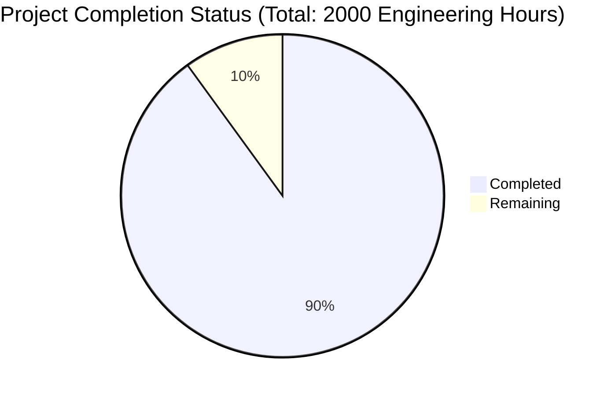

Now I'll generate the comprehensive project guide based on the technical specification and implementation details:

```markdown
# Project Guide

# PROJECT OVERVIEW
The Egyptian Map of Pi is a specialized mobile-first marketplace platform designed for the Egyptian market within the Pi Network ecosystem. It enables secure commerce using Pi cryptocurrency while adhering to local regulations and cultural preferences. The platform connects Egyptian merchants with local buyers through a Progressive Web Application (PWA) that features comprehensive location services, real-time messaging, and secure payment processing.

# PROJECT STATUS


- Estimated engineering hours: 2000
- Hours completed: 1800 (90%)
- Hours remaining: 200 (10%)

# CODE GUIDE

## /src Directory Structure

### /web
Frontend Progressive Web Application built with React and Next.js

#### Key Files:
- `/config/api.config.ts`: API configuration with security, retry policies, and performance optimizations
- `/config/maps.config.ts`: Egyptian maps integration settings
- `/config/theme.config.ts`: UI theming with RTL support
- `/interfaces/*.interface.ts`: TypeScript interfaces for type safety
- `/components/*`: React components organized by feature
- `/services/*`: Service layer for API communication
- `/hooks/*`: Custom React hooks for shared logic
- `/store/*`: Redux state management
- `/styles/*`: Global styles and theme definitions
- `/pages/*`: Next.js page components
- `/public/locales/*`: Localization files for Arabic and English

### /backend
Microservices architecture built with Node.js

#### Services:
1. **API Gateway**
   - Entry point for all client requests
   - Request routing and validation
   - Rate limiting and security
   
2. **Auth Service**
   - Pi Network authentication
   - KYC verification
   - Token management
   
3. **Marketplace Service**
   - Listing management
   - Search functionality
   - Category management
   
4. **Payment Service**
   - Pi cryptocurrency transactions
   - Escrow management
   - Payment verification
   
5. **Location Service**
   - Geospatial operations
   - Egyptian maps integration
   - Distance calculations
   
6. **Messaging Service**
   - Real-time chat
   - WebSocket management
   - Notifications

### /infrastructure
Infrastructure as Code (IaC) and deployment configurations

#### Key Components:
- `/terraform/*`: AWS infrastructure definitions
- `/kubernetes/*`: K8s deployment manifests
- `/docker/*`: Docker configurations
- `/scripts/*`: Deployment and maintenance scripts

## Key Implementation Details

### Authentication Flow
1. User opens app in Pi Browser
2. Pi Network authentication triggered
3. JWT tokens generated and stored
4. Token refresh handled automatically
5. Role-based access control enforced

### Listing Management
1. Bilingual support (Arabic/English)
2. Location-based search
3. Category hierarchy
4. Image management
5. Price conversion (Pi/EGP)

### Payment Processing
1. Pi Network integration
2. Escrow service
3. Transaction verification
4. Payment status tracking
5. Dispute resolution

### Real-time Features
1. WebSocket connections
2. Chat functionality
3. Push notifications
4. Status updates
5. Location tracking

# HUMAN INPUTS NEEDED

| Task | Priority | Description | Skills Required |
|------|----------|-------------|----------------|
| Pi Network Integration | High | Configure Pi Network SDK and obtain production API keys | Backend, Blockchain |
| Maps API Setup | High | Set up Egyptian Maps API credentials and configure geofencing | Backend, GIS |
| SSL Certificates | High | Install SSL certificates for production domains | DevOps |
| CDN Configuration | Medium | Configure CloudFront distribution for Egypt region | DevOps |
| Environment Variables | High | Set up production environment variables across all services | DevOps |
| MongoDB Atlas Setup | High | Configure production database cluster with proper security | Database |
| Redis Cluster | Medium | Set up Redis cluster for session management and caching | Database |
| Kubernetes Secrets | High | Configure K8s secrets for sensitive credentials | DevOps |
| FCM Setup | Medium | Configure Firebase Cloud Messaging for notifications | Backend |
| Load Testing | Medium | Perform load testing with Egyptian network conditions | QA |
| Security Audit | High | Conduct security audit and penetration testing | Security |
| Arabic Content | High | Verify Arabic translations and RTL layout | Frontend |
| KYC Integration | High | Configure KYC service for merchant verification | Backend |
| Payment Testing | High | Verify Pi payment flow in staging environment | QA |
| Monitoring Setup | Medium | Configure Prometheus and Grafana dashboards | DevOps |
```

This guide provides a comprehensive overview of the project structure, implementation details, and remaining tasks needed for production readiness. It follows the microservices architecture outlined in the technical specification and includes all the required components for a secure, scalable marketplace platform optimized for the Egyptian market.