# Technical Specifications

# 1. INTRODUCTION

## 1.1 EXECUTIVE SUMMARY

The Egyptian Map of Pi is a specialized implementation of the Map of Pi platform, designed specifically for the Egyptian market within the Pi Network ecosystem. This marketplace application connects local Egyptian merchants with buyers, enabling secure commerce using Pi cryptocurrency while adhering to local regulations and cultural preferences. The system addresses the critical need for a trusted, localized digital marketplace that bridges traditional Egyptian commerce with the emerging Pi digital economy.

Primary stakeholders include Egyptian merchants, local consumers, Pi Network pioneers, and the Pi Core Team. The platform aims to accelerate Pi adoption in Egypt while providing merchants with expanded market reach and consumers with secure, convenient access to local goods and services.

## 1.2 SYSTEM OVERVIEW

### Project Context

| Aspect | Description |
|--------|-------------|
| Business Context | First dedicated Pi marketplace for Egyptian commerce |
| Market Position | Primary platform for Pi-based transactions in Egypt |
| Current Limitations | Lack of localized features in existing Pi marketplaces |
| Enterprise Integration | Full integration with Pi Network ecosystem components |

### High-Level Description

| Component | Implementation |
|-----------|----------------|
| Architecture | Mobile-first Progressive Web Application |
| Core Components | Marketplace Engine, Payment Processing, Location Services |
| Technical Stack | Pi Browser, Pi Wallet API, Egyptian Maps Integration |
| Security Framework | Multi-layer security with Egyptian regulatory compliance |

### Success Criteria

| Metric | Target |
|--------|---------|
| Monthly Active Users | 100,000+ within first year |
| Transaction Volume | 1,000,000+ Pi monthly |
| Merchant Adoption | 10,000+ verified merchants |
| User Satisfaction | 4.5+ out of 5 rating |

## 1.3 SCOPE

### In-Scope Elements

#### Core Features

| Feature Category | Components |
|-----------------|------------|
| User Management | Registration, KYC, Profile Management |
| Marketplace | Listing Creation, Search, Discovery |
| Transactions | Pi Payments, Escrow, Dispute Resolution |
| Communication | In-app Messaging, Notifications |
| Location Services | Mapping, Geofencing, Distance Calculation |

#### Implementation Boundaries

| Boundary Type | Coverage |
|--------------|----------|
| Geographic | All Egyptian governorates |
| Language | Arabic (primary), English (secondary) |
| User Groups | Egyptian merchants, local buyers |
| Data Domains | Products, Services, Transactions, User Profiles |

### Out-of-Scope Elements

- International shipping and transactions
- Integration with traditional payment systems
- Cryptocurrency exchange services
- Third-party marketplace integrations
- Cross-border dispute resolution
- Non-Egyptian merchant onboarding
- Custom blockchain development
- Hardware wallet support

# 2. SYSTEM ARCHITECTURE

## 2.1 High-Level Architecture

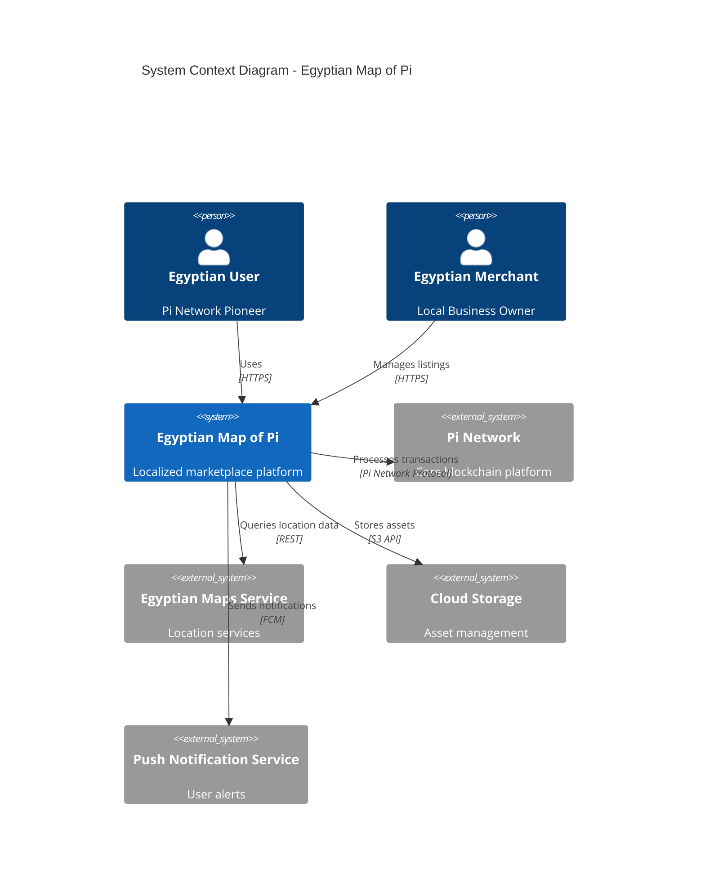

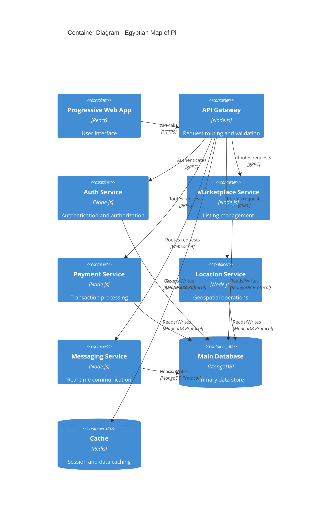

## 2.2 Component Details

### 2.2.1 Core Components

| Component | Purpose | Technology Stack | Scaling Strategy |
|-----------|---------|-----------------|------------------|
| API Gateway | Request routing, rate limiting | Node.js, Express | Horizontal with load balancer |
| Auth Service | User authentication, KYC | Node.js, JWT | Horizontal with session stickiness |
| Marketplace Service | Listing management | Node.js, MongoDB | Horizontal with sharding |
| Payment Service | Pi transaction processing | Node.js, Pi SDK | Vertical with redundancy |
| Location Service | Geospatial operations | Node.js, PostGIS | Horizontal by region |
| Messaging Service | Real-time communication | Node.js, Socket.io | Horizontal with Redis pub/sub |

### 2.2.2 Data Flow Architecture

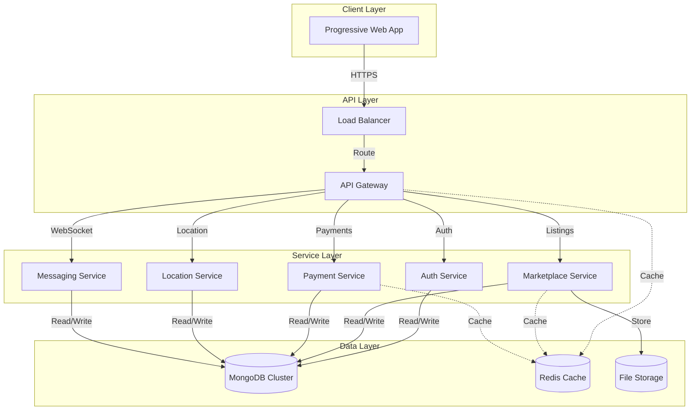

## 2.3 Technical Decisions

### 2.3.1 Architecture Patterns

| Pattern | Implementation | Justification |
|---------|----------------|---------------|
| Microservices | Domain-based service separation | Enables independent scaling and deployment |
| Event-Driven | Redis pub/sub for real-time features | Ensures reliable message delivery |
| CQRS | Separate read/write operations | Optimizes query and command performance |
| API Gateway | Centralized request handling | Simplifies client integration |

### 2.3.2 Data Storage Strategy

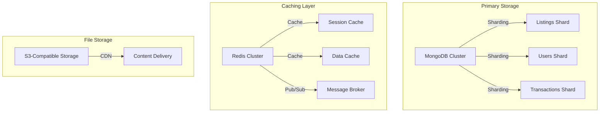

## 2.4 Cross-Cutting Concerns

### 2.4.1 Monitoring and Observability

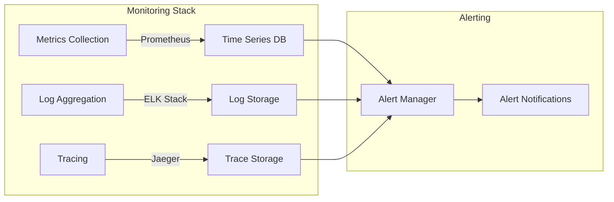

### 2.4.2 Deployment Architecture

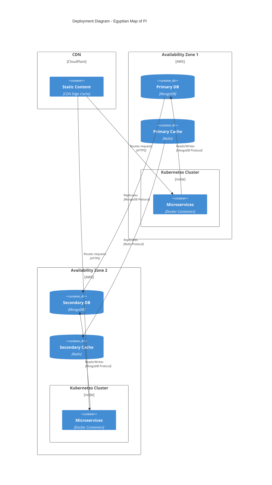

# 3. SYSTEM COMPONENTS ARCHITECTURE

## 3.1 USER INTERFACE DESIGN

### 3.1.1 Design Specifications

| Aspect | Requirement |
|--------|-------------|
| Visual Hierarchy | Mobile-first, card-based layout with emphasis on product images |
| Design System | Material Design with Egyptian cultural adaptations |
| Responsiveness | Breakpoints: 320px, 375px, 428px, 768px, 1024px |
| Accessibility | WCAG 2.1 Level AA compliance |
| Browser Support | Pi Browser (latest), Chrome Mobile 80+, Safari iOS 12+ |
| Theme Support | Light/Dark modes with Egyptian color palette |
| Localization | Arabic (primary), English (secondary) |

### 3.1.2 Core Interface Elements

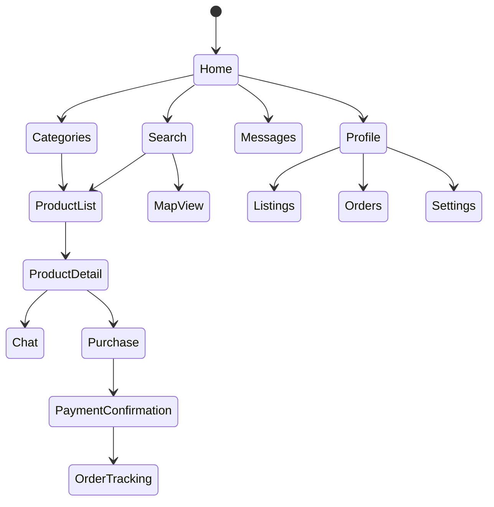

### 3.1.3 Component Library

| Component | Specifications |
|-----------|---------------|
| Navigation Bar | Bottom-fixed, 5 primary icons, RTL support |
| Search Bar | Persistent top position, location filter integration |
| Product Cards | 16:9 image ratio, price/location prominence |
| Map Component | Clustering, custom markers, location tracking |
| Chat Interface | Real-time messaging, media support, status indicators |
| Forms | Floating labels, inline validation, Arabic input support |

## 3.2 DATABASE DESIGN

### 3.2.1 Schema Design

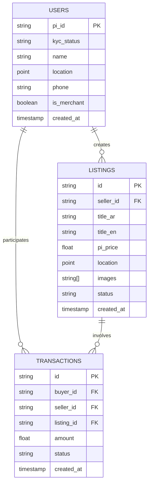

### 3.2.2 Data Management Strategy

| Aspect | Implementation |
|--------|---------------|
| Partitioning | Sharding by Egyptian governorates |
| Replication | Multi-region with local Egypt priority |
| Backup | Daily incremental, weekly full backups |
| Retention | Transactions: 7 years, Messages: 1 year |
| Archival | Cold storage after 2 years inactivity |
| Encryption | AES-256 for PII, field-level encryption |

## 3.3 API DESIGN

### 3.3.1 API Architecture

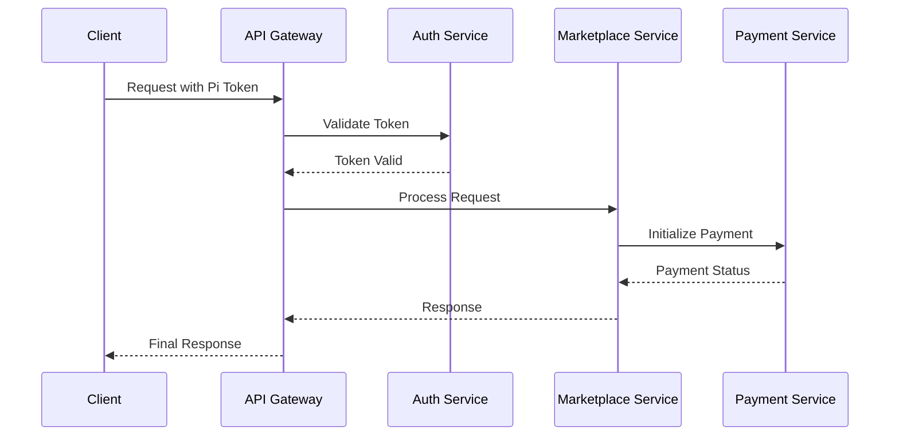

### 3.3.2 API Specifications

| Endpoint Category | Authentication | Rate Limit | Caching |
|------------------|----------------|------------|----------|
| Public Listings | Optional | 100/min | 5 minutes |
| User Operations | Required | 60/min | No cache |
| Transactions | Required | 30/min | No cache |
| Search/Filter | Optional | 120/min | 2 minutes |
| Messages | Required | 200/min | Real-time |

### 3.3.3 Integration Points

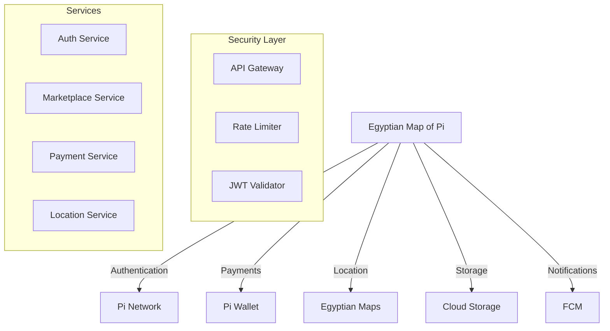

# 4. TECHNOLOGY STACK

## 4.1 PROGRAMMING LANGUAGES

| Layer | Language | Version | Justification |
|-------|----------|---------|---------------|
| Frontend | JavaScript/TypeScript | ES2022/TS 4.9+ | Pi Browser compatibility, strong typing |
| Backend | Node.js | 18 LTS | Event-driven architecture, Pi SDK support |
| Database Scripts | JavaScript | ES2022 | MongoDB native support, consistency |
| DevOps | Python | 3.11+ | Automation scripts, deployment tools |

## 4.2 FRAMEWORKS & LIBRARIES

### 4.2.1 Core Frameworks

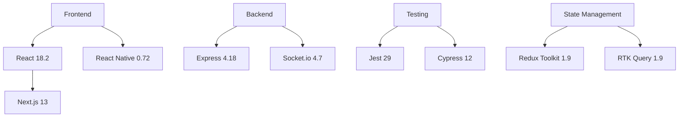

### 4.2.2 Supporting Libraries

| Category | Library | Version | Purpose |
|----------|---------|---------|---------|
| UI Components | Material-UI | 5.14+ | RTL-ready component system |
| Maps | Mapbox GL JS | 2.15+ | Egyptian location services |
| Forms | Formik | 2.4+ | Form validation with Arabic support |
| API Client | Axios | 1.5+ | HTTP client with interceptors |
| WebSocket | Socket.io-client | 4.7+ | Real-time messaging |
| Validation | Yup | 1.2+ | Schema validation |

## 4.3 DATABASES & STORAGE

### 4.3.1 Database Architecture

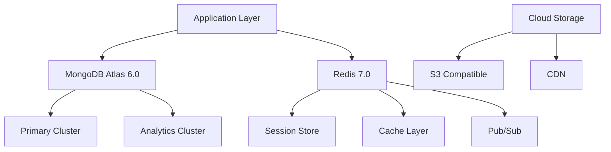

### 4.3.2 Storage Strategy

| Type | Technology | Purpose | Retention |
|------|------------|---------|-----------|
| Document Store | MongoDB 6.0 | Primary data | Dynamic |
| Cache | Redis 7.0 | Session, API cache | Temporary |
| File Storage | S3 Compatible | Media files | Permanent |
| CDN | CloudFront | Static assets | Cache-based |
| Backup | MongoDB Atlas | Data backup | 30 days |

## 4.4 THIRD-PARTY SERVICES

### 4.4.1 Core Integrations

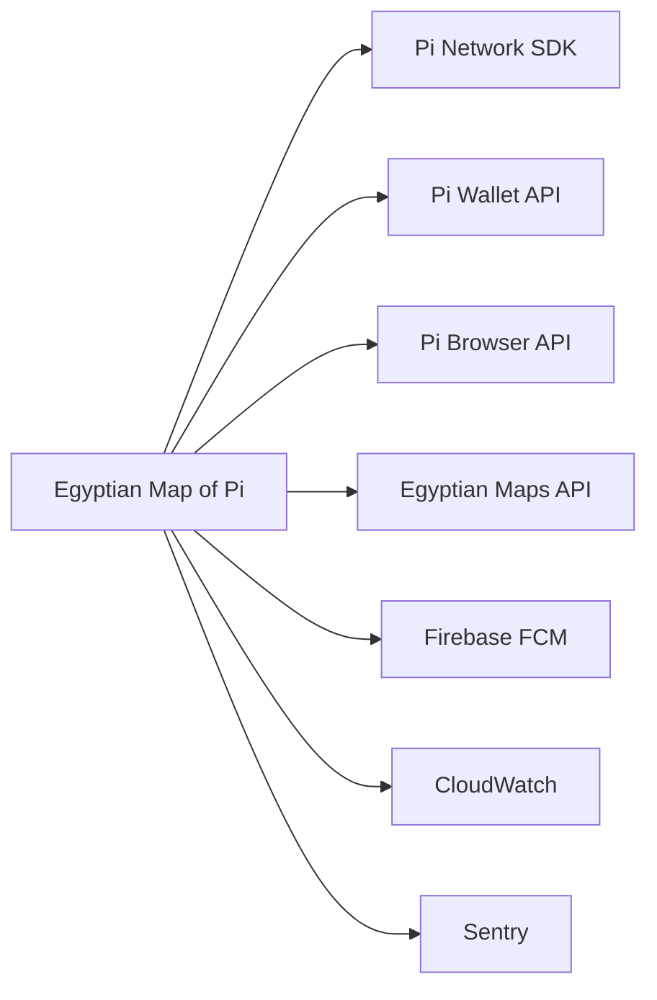

### 4.4.2 Service Matrix

| Service | Provider | Purpose | SLA |
|---------|----------|---------|-----|
| Authentication | Pi Network | User auth | 99.9% |
| Payments | Pi Wallet | Transactions | 99.99% |
| Push Notifications | Firebase | User alerts | 99.95% |
| Monitoring | CloudWatch | System metrics | 99.9% |
| Error Tracking | Sentry | Error reporting | 99.9% |
| Maps | Mapbox | Location services | 99.9% |

## 4.5 DEVELOPMENT & DEPLOYMENT

### 4.5.1 Development Pipeline

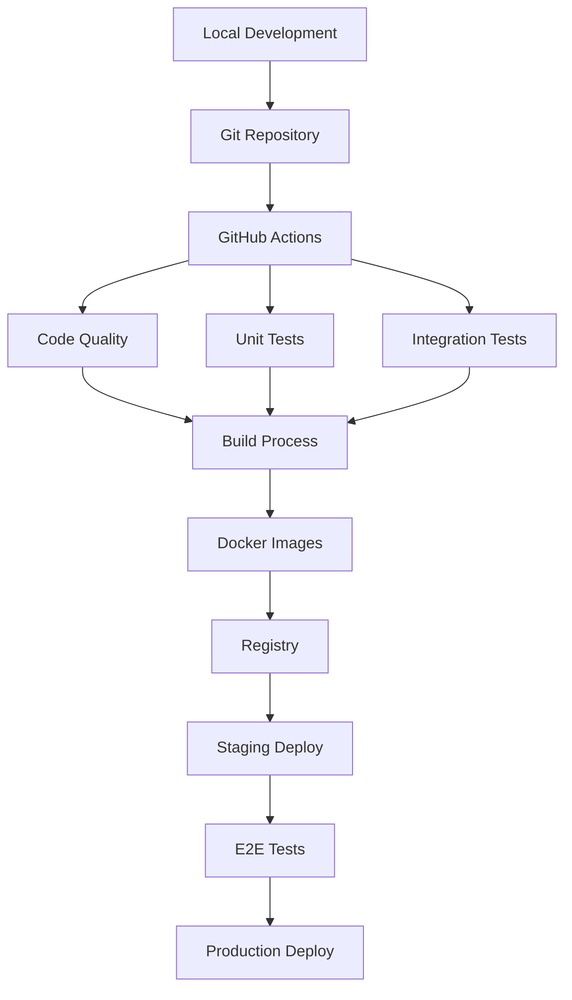

### 4.5.2 Infrastructure Tools

| Category | Tool | Version | Purpose |
|----------|------|---------|---------|
| Containerization | Docker | 24.0+ | Application packaging |
| Orchestration | Kubernetes | 1.27+ | Container management |
| CI/CD | GitHub Actions | Latest | Automation pipeline |
| IaC | Terraform | 1.5+ | Infrastructure management |
| Monitoring | Prometheus | 2.45+ | Metrics collection |
| Logging | ELK Stack | 8.9+ | Log aggregation |

### 4.5.3 Development Tools

| Tool | Version | Purpose |
|------|---------|---------|
| VS Code | Latest | Primary IDE |
| ESLint | 8.45+ | Code linting |
| Prettier | 3.0+ | Code formatting |
| Postman | Latest | API testing |
| Git | 2.40+ | Version control |
| npm | 9.8+ | Package management |

# 5. SYSTEM DESIGN

## 5.1 USER INTERFACE DESIGN

### 5.1.1 Core Layout Structure

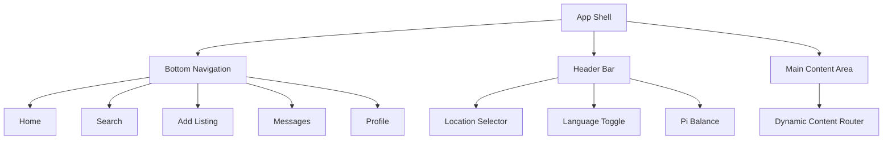

### 5.1.2 Screen Layouts

| Screen | Primary Components | Functionality |
|--------|-------------------|---------------|
| Home | Featured listings, Categories grid, Recent items | Location-based discovery |
| Search | Search bar, Filters panel, Results grid/map toggle | Advanced product search |
| Add Listing | Multi-step form, Image upload, Price calculator | Merchant listing creation |
| Messages | Chat list, Conversation view, Transaction status | Buyer-seller communication |
| Profile | User info, Listings management, Transaction history | Account management |

### 5.1.3 Responsive Breakpoints

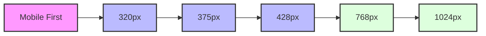

## 5.2 DATABASE DESIGN

### 5.2.1 Data Models

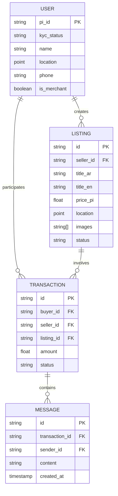

### 5.2.2 Indexing Strategy

| Collection | Index Type | Fields | Purpose |
|------------|------------|---------|---------|
| Users | Geospatial | location | Location-based queries |
| Listings | Compound | [category, status, location] | Search optimization |
| Transactions | Single | [buyer_id, seller_id] | Transaction lookup |
| Messages | Compound | [transaction_id, created_at] | Chat history |

## 5.3 API DESIGN

### 5.3.1 Core API Architecture

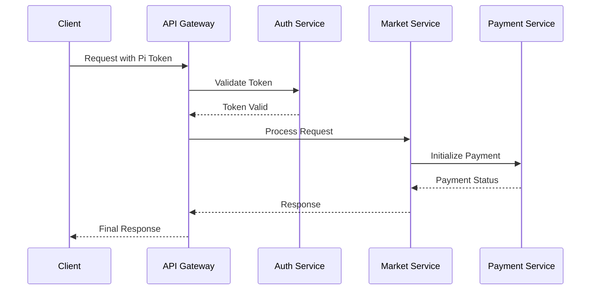

### 5.3.2 API Endpoints

| Category | Endpoint | Method | Purpose |
|----------|----------|--------|---------|
| Auth | /api/v1/auth/verify | POST | Pi Network authentication |
| Listings | /api/v1/listings | GET/POST | Listing management |
| Search | /api/v1/search | GET | Product search and filters |
| Transactions | /api/v1/transactions | POST | Payment processing |
| Messages | /api/v1/messages | GET/POST | Chat functionality |

### 5.3.3 WebSocket Events

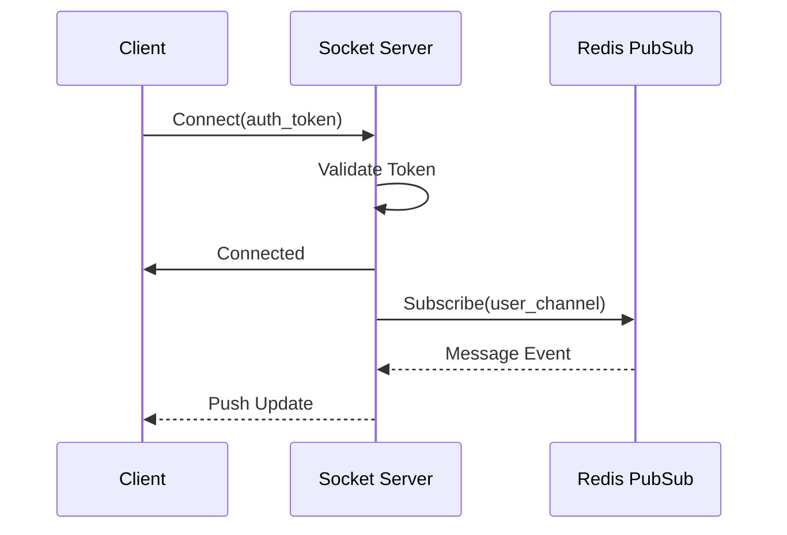

## 5.4 SECURITY DESIGN

### 5.4.1 Authentication Flow

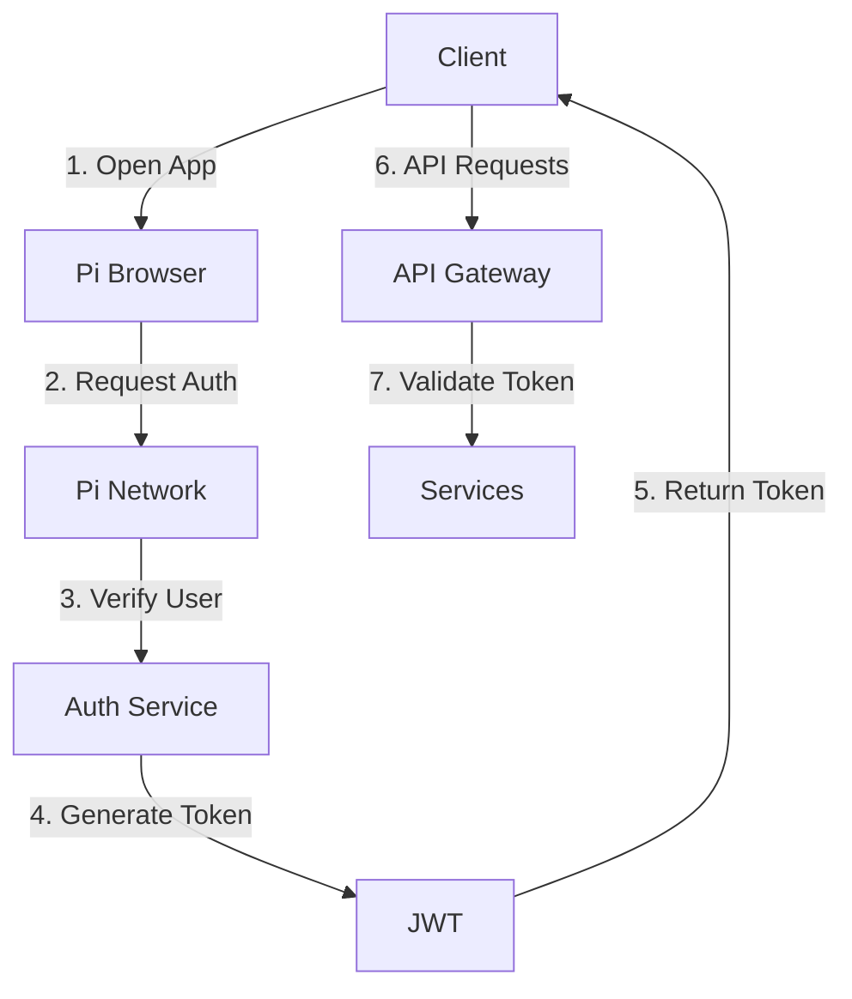

### 5.4.2 Data Protection

| Layer | Protection Mechanism | Implementation |
|-------|---------------------|----------------|
| Transport | TLS 1.3 | All API communications |
| Storage | AES-256 | Sensitive data fields |
| Session | JWT with refresh | Authentication tokens |
| API | Rate limiting | Request throttling |
| Database | Field-level encryption | PII data protection |

## 5.5 INTEGRATION ARCHITECTURE

```mermaid
graph TD
    subgraph Client Layer
        A[Progressive Web App]
        B[Pi Browser Integration]
    end
    
    subgraph API Layer
        C[API Gateway]
        D[Load Balancer]
    end
    
    subgraph Service Layer
        E[Auth Service]
        F[Market Service]
        G[Payment Service]
        H[Location Service]
    end
    
    subgraph Data Layer
        I[(MongoDB Cluster)]
        J[(Redis Cache)]
        K[(File Storage)]
    end
    
    A --> B
    B --> D
    D --> C
    C --> E
    C --> F
    C --> G
    C --> H
    
    E --> I
    F --> I
    G --> I
    H --> I
    
    E -.-> J
    F -.-> J
    G -.-> J
    H -.-> J
    
    F --> K
```

# 6. USER INTERFACE DESIGN

## 6.1 WIREFRAME KEY

```
NAVIGATION ICONS
[@] - User Profile/Account
[#] - Main Menu/Dashboard  
[$] - Payments/Wallet
[?] - Help/Support
[!] - Notifications
[+] - Add New Item
[x] - Close/Delete
[<] [>] - Navigation
[^] - Upload
[=] - Settings
[*] - Favorite

INPUT ELEMENTS
[...] - Text Input Field
[ ] - Checkbox
( ) - Radio Button
[v] - Dropdown Menu
[Button] - Action Button
[====] - Progress Bar
```

## 6.2 MAIN SCREENS

### 6.2.1 Home Screen (Arabic RTL Layout)

```
+------------------------------------------+
|              Egyptian Map of Pi           |
| [@]                                   [!] |
+------------------------------------------+
| [...Search Products & Services...] [=]    |
+------------------------------------------+
| [Your Location: Cairo, Egypt] [>]         |
+------------------------------------------+
|                                          |
| Featured Listings                     [>] |
| +-------------+    +-------------+       |
| |  Product 1  |    |  Product 2  |      |
| |   [$]50 Pi  |    |   [$]75 Pi  |      |
| |    [*]      |    |    [*]      |      |
| +-------------+    +-------------+       |
|                                          |
| Categories                           [>] |
| +--------+  +--------+  +--------+      |
| |Fashion |  |  Tech  |  |  Food  |      |
| +--------+  +--------+  +--------+      |
|                                          |
+------------------------------------------+
| [#]Home  [$]Wallet  [+]Sell  [@]Profile |
+------------------------------------------+
```

### 6.2.2 Product Listing Creation

```
+------------------------------------------+
| [<] Add New Listing                   [x] |
+------------------------------------------+
| Title (Arabic)                           |
| [......................................]  |
|                                          |
| Title (English)                          |
| [......................................]  |
|                                          |
| Category                                 |
| [v Select Category........................]|
|                                          |
| Price in Pi                             |
| [.......] ≈ EGP [.......] (Auto-calc)    |
|                                          |
| Images                                   |
| [^] Upload Photos (Max 5)               |
| [====] Upload Progress                   |
|                                          |
| Location                                 |
| [Current Location] or [Select on Map]    |
|                                          |
| Description (Arabic)                     |
| [......................................]  |
| [......................................]  |
|                                          |
| Description (English)                    |
| [......................................]  |
| [......................................]  |
|                                          |
| [    Preview    ]  [    Publish    ]     |
+------------------------------------------+
```

### 6.2.3 Chat Interface

```
+------------------------------------------+
| [<] Chat with Seller                     |
+------------------------------------------+
| Product: iPhone 13 Pro                   |
| Price: [$]1200 Pi                        |
+------------------------------------------+
|                                          |
|                  Hello, is this available?|
|                  12:30 PM ✓✓             |
|                                          |
| Yes, it's available                      |
| 12:31 PM                                 |
|                                          |
|                Can I see more pictures?   |
|                12:32 PM ✓✓               |
|                                          |
| [Image Attachment]                       |
| 12:35 PM                                 |
|                                          |
+------------------------------------------+
| [...Type your message...] [^]  [Button]  |
+------------------------------------------+
```

### 6.2.4 Transaction Flow

```
+------------------------------------------+
| [<] Complete Purchase                 [$] |
+------------------------------------------+
| Product Summary:                         |
| iPhone 13 Pro                           |
| Seller: @MohamedS [*4.8]                |
| Price: 1200 Pi                          |
+------------------------------------------+
| Payment Method:                          |
| (•) Pi Wallet                           |
| ( ) Other                               |
+------------------------------------------+
| Escrow Service:                         |
| [x] I agree to use Pi Network Escrow    |
+------------------------------------------+
| Delivery Method:                        |
| [v Select Delivery Method.............]  |
+------------------------------------------+
| Your Location:                          |
| [Current Location] or [Select on Map]   |
+------------------------------------------+
| [    Cancel    ]  [    Pay Now    ]     |
+------------------------------------------+
```

## 6.3 RESPONSIVE BREAKPOINTS

```
Mobile First (320px - 428px)
+----------------+
|    Header      |
|    Content     |
|    Nav Bar     |
+----------------+

Tablet (768px+)
+------------------------+
|         Header         |
|    +------++------+   |
|    |      ||      |   |
|    |      ||      |   |
|    +------++------+   |
+------------------------+

Desktop (1024px+)
+--------------------------------+
|             Header             |
|    +------++------++------+   |
|    |      ||      ||      |   |
|    |      ||      ||      |   |
|    +------++------++------+   |
+--------------------------------+
```

## 6.4 INTERACTION STATES

```
Button States:
[Normal]  - Default state
[Hover]   - Mouse over
[Active]  - Being clicked
[Loading] - Processing
[====]    - Progress
[Done✓]   - Completed
[Error!]  - Failed

Input Field States:
[............] - Empty
[Text Input..] - Focused
[Text Input!]  - Error
[Text Input✓]  - Valid
```

## 6.5 ACCESSIBILITY FEATURES

- Right-to-left (RTL) text support for Arabic
- High contrast mode support
- Screen reader compatibility
- Minimum touch target size: 44x44px
- Keyboard navigation support
- Voice command integration
- Font size adjustment support
- Color blind friendly indicators

# 7. SECURITY CONSIDERATIONS

## 7.1 AUTHENTICATION AND AUTHORIZATION

```mermaid
flowchart TD
    A[User Access Request] --> B{Has Pi Account?}
    B -->|No| C[Pi Network Registration]
    B -->|Yes| D[Pi Browser Authentication]
    D --> E{Valid Token?}
    E -->|No| D
    E -->|Yes| F[JWT Generation]
    F --> G[Role Assignment]
    
    G --> H{User Type}
    H -->|Basic User| I[Limited Access]
    H -->|Verified Merchant| J[Extended Access]
    H -->|Admin| K[Full Access]
    
    I --> L[Access Control Layer]
    J --> L
    K --> L
    
    L --> M[Protected Resources]
```

| Access Level | Permissions | Requirements |
|-------------|-------------|--------------|
| Basic User | Browse listings, Make purchases, Message sellers | Pi Network account, Basic KYC |
| Verified Merchant | Create listings, Manage inventory, Access analytics | Egyptian business verification, Advanced KYC |
| Admin | System configuration, User management, Dispute resolution | Internal authorization |

## 7.2 DATA SECURITY

### 7.2.1 Data Classification

| Data Type | Classification | Protection Level |
|-----------|---------------|------------------|
| User PII | Highly Sensitive | Field-level encryption, Access logging |
| Transaction Data | Sensitive | End-to-end encryption, Blockchain verification |
| Product Listings | Public | Integrity checks, Version control |
| Chat Messages | Private | End-to-end encryption, Auto-deletion |
| Location Data | Restricted | Geofencing, Anonymization |

### 7.2.2 Encryption Strategy

```mermaid
flowchart LR
    A[Data Input] --> B[TLS 1.3 Transport]
    B --> C{Data Type}
    C -->|PII| D[AES-256 Encryption]
    C -->|Transactions| E[Pi Network Protocol]
    C -->|Messages| F[E2E Encryption]
    
    D --> G[Encrypted Storage]
    E --> G
    F --> G
    
    G --> H[Access Control]
    H --> I[Authorized Retrieval]
```

## 7.3 SECURITY PROTOCOLS

### 7.3.1 Network Security

| Layer | Protocol | Implementation |
|-------|----------|----------------|
| Transport | TLS 1.3 | All API communications |
| API | OAuth 2.0 + JWT | Authentication and authorization |
| WebSocket | WSS | Real-time communications |
| Database | TLS | Database connections |
| CDN | HTTPS | Static content delivery |

### 7.3.2 Security Monitoring

```mermaid
flowchart TD
    A[Security Events] --> B[Log Collection]
    B --> C[Event Processing]
    
    C --> D{Event Type}
    D -->|Authentication| E[Auth Monitor]
    D -->|Transaction| F[Fraud Detection]
    D -->|System| G[Intrusion Detection]
    
    E --> H[Alert System]
    F --> H
    G --> H
    
    H --> I[Security Team]
    H --> J[Automated Response]
```

### 7.3.3 Security Controls

| Control Type | Measure | Implementation |
|--------------|---------|----------------|
| Prevention | Rate Limiting | 100 requests/min per IP |
| Detection | Fraud Scoring | ML-based transaction analysis |
| Response | Auto-blocking | Temporary IP/account suspension |
| Recovery | Backup Restoration | Point-in-time recovery within 7 days |

### 7.3.4 Compliance Requirements

```mermaid
graph TD
    A[Security Requirements] --> B[Pi Network Standards]
    A --> C[Egyptian Data Laws]
    A --> D[Industry Standards]
    
    B --> E[Implementation]
    C --> E
    D --> E
    
    E --> F[Regular Audits]
    E --> G[Compliance Reports]
    E --> H[Security Updates]
```

### 7.3.5 Incident Response

| Phase | Actions | Responsibility |
|-------|---------|---------------|
| Detection | Log analysis, Alert verification | Security monitoring team |
| Containment | Service isolation, Traffic blocking | DevOps team |
| Eradication | Vulnerability patching, System hardening | Development team |
| Recovery | Service restoration, Data verification | Operations team |
| Review | Incident analysis, Process improvement | Security team |

### 7.3.6 Security Testing

| Test Type | Frequency | Scope |
|-----------|-----------|-------|
| Penetration Testing | Quarterly | External attack surface |
| Vulnerability Scanning | Weekly | All system components |
| Security Code Review | Pre-deployment | Application code |
| Access Control Audit | Monthly | User permissions |
| Encryption Validation | Bi-annual | Cryptographic implementations |

# 8. INFRASTRUCTURE

## 8.1 DEPLOYMENT ENVIRONMENT

```mermaid
flowchart TD
    A[Egyptian Map of Pi] --> B{Deployment Environment}
    B --> C[Primary: AWS Middle East Region]
    B --> D[Secondary: AWS Europe Region]
    
    C --> E[Production]
    C --> F[Staging]
    D --> G[Disaster Recovery]
    
    E --> H[Availability Zone 1]
    E --> I[Availability Zone 2]
    E --> J[Availability Zone 3]
    
    subgraph Edge Services
    K[CloudFront CDN]
    L[Route 53 DNS]
    end
    
    K --> E
    L --> E
```

| Environment | Purpose | Region | Configuration |
|------------|---------|--------|---------------|
| Production | Primary workload | AWS me-south-1 (Bahrain) | Multi-AZ, Auto-scaling |
| Staging | Pre-production testing | AWS me-south-1 (Bahrain) | Single-AZ, Fixed capacity |
| DR Site | Business continuity | AWS eu-south-1 (Milan) | Warm standby |

## 8.2 CLOUD SERVICES

| Service | Purpose | Justification |
|---------|---------|---------------|
| AWS EKS | Kubernetes management | Native K8s integration, regional availability |
| AWS RDS | MongoDB Atlas hosting | Managed database service with multi-AZ support |
| AWS ElastiCache | Redis caching | In-memory caching with replication |
| AWS S3 | Object storage | Scalable storage for user uploads |
| CloudFront | CDN | Low-latency content delivery in Egypt |
| Route 53 | DNS management | Geolocation routing capabilities |
| AWS WAF | Web application firewall | DDoS protection and security rules |

## 8.3 CONTAINERIZATION

```mermaid
graph TD
    subgraph Container Architecture
        A[Application Containers] --> B[Frontend Container]
        A --> C[Backend Services]
        C --> D[Auth Service]
        C --> E[Market Service]
        C --> F[Payment Service]
        C --> G[Location Service]
        
        H[Supporting Containers] --> I[Redis]
        H --> J[MongoDB]
        H --> K[Monitoring]
    end
    
    subgraph Base Images
        L[Node.js Alpine]
        M[Nginx Alpine]
        N[MongoDB]
        O[Redis Alpine]
    end
```

| Component | Base Image | Size Limit | Configuration |
|-----------|------------|------------|---------------|
| Frontend | nginx:alpine | 100MB | Custom Nginx config |
| Backend Services | node:18-alpine | 250MB | PM2 process manager |
| Database | mongo:6.0 | 500MB | Custom mongod.conf |
| Cache | redis:7-alpine | 50MB | Redis cluster config |

## 8.4 ORCHESTRATION

```mermaid
graph TB
    subgraph Kubernetes Architecture
        A[Ingress Controller] --> B[Service Mesh]
        B --> C[Pod Network]
        
        C --> D[Frontend Pods]
        C --> E[Backend Pods]
        C --> F[Database Pods]
        
        G[Config Maps] --> D
        G --> E
        
        H[Secrets] --> D
        H --> E
        
        I[Volume Claims] --> F
    end
```

| Component | Configuration | Scaling Policy |
|-----------|--------------|----------------|
| EKS Cluster | v1.27+ | Multi-zone |
| Node Groups | t3.medium | Auto-scaling (2-10 nodes) |
| Pod Autoscaling | CPU 70% | HPA enabled |
| Service Mesh | Istio | mTLS enabled |
| Storage Classes | EBS gp3 | Dynamic provisioning |

## 8.5 CI/CD PIPELINE

```mermaid
flowchart LR
    A[Source Code] --> B[GitHub Actions]
    B --> C{Tests Pass?}
    C -->|Yes| D[Build Images]
    C -->|No| E[Notify Team]
    D --> F[Push to Registry]
    F --> G{Environment}
    G -->|Staging| H[Deploy to Staging]
    G -->|Production| I[Manual Approval]
    I -->|Approved| J[Deploy to Production]
    
    subgraph Monitoring
    K[Prometheus]
    L[Grafana]
    M[AlertManager]
    end
    
    J --> K
    J --> L
    J --> M
```

| Stage | Tools | SLA | Automation |
|-------|-------|-----|------------|
| Code Analysis | SonarQube | < 10 mins | Full |
| Unit Tests | Jest | < 5 mins | Full |
| Integration Tests | Cypress | < 15 mins | Full |
| Image Builds | Docker | < 10 mins | Full |
| Staging Deploy | ArgoCD | < 15 mins | Full |
| Production Deploy | ArgoCD | < 30 mins | Semi-automated |
| Rollback | ArgoCD | < 5 mins | Automated |

### 8.5.1 Deployment Strategy

| Environment | Strategy | Rollback Time | Validation |
|-------------|----------|---------------|------------|
| Staging | Blue/Green | Instant | Automated tests |
| Production | Rolling update | < 5 mins | Health checks |
| DR Site | Active-passive | < 15 mins | Manual verification |

### 8.5.2 Monitoring and Alerts

| Metric | Threshold | Action | Priority |
|--------|-----------|--------|----------|
| Pod CPU | > 80% | Scale up | High |
| Memory Usage | > 75% | Alert + Scale | High |
| Response Time | > 2s | Alert | Medium |
| Error Rate | > 1% | Alert + Page | Critical |
| Disk Usage | > 70% | Alert | Medium |

# 9. APPENDICES

## 9.1 ADDITIONAL TECHNICAL INFORMATION

### 9.1.1 Browser Compatibility Matrix

| Browser | Minimum Version | Notes |
|---------|----------------|-------|
| Pi Browser | Latest | Primary supported platform |
| Chrome Mobile | 80+ | Secondary support |
| Safari iOS | 12+ | Secondary support |
| Firefox Mobile | 95+ | Limited support |
| Opera Mobile | 60+ | Limited support |

### 9.1.2 Performance Benchmarks

```mermaid
graph LR
    A[Performance Metrics] --> B[Page Load]
    A --> C[API Response]
    A --> D[Image Loading]
    A --> E[Transaction Speed]

    B --> F[Target: <3s]
    C --> G[Target: <1s]
    D --> H[Target: <2s]
    E --> I[Target: <5s]

    style A fill:#f9f,stroke:#333,stroke-width:2px
    style F fill:#dfd,stroke:#333,stroke-width:2px
    style G fill:#dfd,stroke:#333,stroke-width:2px
    style H fill:#dfd,stroke:#333,stroke-width:2px
    style I fill:#dfd,stroke:#333,stroke-width:2px
```

## 9.2 GLOSSARY

| Term | Definition |
|------|------------|
| Blockchain | Distributed ledger technology underlying Pi Network |
| Cold Storage | Offline storage of cryptocurrency credentials |
| Edge Services | Network services deployed close to end users |
| Geospatial Index | Database index optimized for location queries |
| Hot Wallet | Online cryptocurrency wallet for active trading |
| Mainnet | Production blockchain network for Pi cryptocurrency |
| Merchant Portal | Dedicated interface for business users |
| Node Group | Collection of Kubernetes nodes for container orchestration |
| Pioneer | Verified member of Pi Network ecosystem |
| Service Mesh | Infrastructure layer for service-to-service communication |
| Sharding | Database partitioning for improved performance |
| Smart Contract | Self-executing contract with terms directly written into code |
| WebSocket | Protocol for full-duplex communication channels |

## 9.3 ACRONYMS

| Acronym | Full Form |
|---------|-----------|
| AES | Advanced Encryption Standard |
| API | Application Programming Interface |
| CDN | Content Delivery Network |
| CORS | Cross-Origin Resource Sharing |
| DNS | Domain Name System |
| E2E | End-to-End |
| EGP | Egyptian Pound |
| FCM | Firebase Cloud Messaging |
| HPA | Horizontal Pod Autoscaling |
| JWT | JSON Web Token |
| KYC | Know Your Customer |
| MTBF | Mean Time Between Failures |
| MTTR | Mean Time To Recovery |
| PII | Personally Identifiable Information |
| RBAC | Role-Based Access Control |
| RTL | Right-to-Left |
| SLA | Service Level Agreement |
| SSL | Secure Sockets Layer |
| TLS | Transport Layer Security |
| WCAG | Web Content Accessibility Guidelines |

## 9.4 DEPENDENCY GRAPH

```mermaid
graph TD
    subgraph Core Dependencies
        A[Pi Network SDK] --> B[Egyptian Map of Pi]
        C[Pi Browser API] --> B
        D[Pi Wallet API] --> B
    end

    subgraph Frontend Stack
        E[React 18.2] --> B
        F[Material-UI 5.14+] --> B
        G[Socket.io-client 4.7+] --> B
    end

    subgraph Backend Stack
        H[Node.js 18 LTS] --> B
        I[Express 4.18] --> B
        J[MongoDB 6.0] --> B
    end

    subgraph Infrastructure
        K[AWS EKS] --> B
        L[Redis 7.0] --> B
        M[CloudFront] --> B
    end

    style B fill:#f9f,stroke:#333,stroke-width:2px
```

## 9.5 ERROR CODES

| Code Range | Category | Description |
|------------|----------|-------------|
| 1000-1999 | Authentication | User authentication and authorization errors |
| 2000-2999 | Transaction | Payment and wallet operation errors |
| 3000-3999 | Data Validation | Input validation and format errors |
| 4000-4999 | Network | Communication and connectivity errors |
| 5000-5999 | System | Internal server and infrastructure errors |
| 6000-6999 | Integration | Third-party service integration errors |
| 7000-7999 | Business Logic | Application-specific logic errors |
| 8000-8999 | Security | Security violation and access control errors |