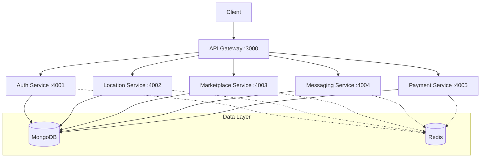

# Egyptian Map of Pi - Backend Services

## Overview

The Egyptian Map of Pi backend is a microservices-based architecture that powers the Egyptian Map of Pi platform - a specialized implementation of the Pi Network marketplace for the Egyptian market. The system is built using Node.js 18 LTS with TypeScript, following enterprise-grade development practices and security standards.

### Architecture Diagram



## Prerequisites

- Node.js >= 18.0.0
- npm >= 9.8.0
- Docker >= 24.0.0
- Docker Compose >= 2.0.0
- MongoDB >= 6.0
- Redis >= 7.0
- SSL Certificates
- Pi Network API Credentials
- Egyptian Maps API Access

## Project Structure

```
src/backend/
├── api-gateway/          # API Gateway Service (Port 3000)
├── auth-service/         # Authentication Service (Port 4001)
├── location-service/     # Location Service (Port 4002)
├── marketplace-service/  # Marketplace Service (Port 4003)
├── messaging-service/    # Messaging Service (Port 4004)
├── payment-service/      # Payment Service (Port 4005)
├── shared/              # Shared libraries and utilities
├── docker-compose.yml   # Docker services configuration
├── package.json         # Root package configuration
└── README.md           # This documentation
```

## Getting Started

### 1. Clone Repository

```bash
git clone https://github.com/pi-network/egyptian-map-pi.git
cd egyptian-map-pi/src/backend
```

### 2. Environment Setup

```bash
# Copy environment template
cp .env.example .env

# Configure environment variables
vi .env

# Install dependencies
npm install

# Bootstrap services
npm run bootstrap
```

### 3. Development Mode

```bash
# Start infrastructure services
docker-compose up -d mongodb redis

# Start all services in development mode
npm run dev

# Or start individual services
cd api-gateway && npm run dev
```

### 4. Production Build

```bash
# Build all services
npm run build

# Start production environment
docker-compose up -d
```

## Services Overview

### API Gateway (Port 3000)
- Request routing and validation
- Rate limiting and security
- API documentation
- Load balancing

### Auth Service (Port 4001)
- Pi Network authentication
- KYC verification
- Session management
- Role-based access control

### Location Service (Port 4002)
- Geospatial operations
- Location-based search
- Egyptian Maps integration
- Distance calculations

### Marketplace Service (Port 4003)
- Listing management
- Search and filtering
- Category management
- Media handling

### Messaging Service (Port 4004)
- Real-time communication
- Chat history
- Notifications
- WebSocket management

### Payment Service (Port 4005)
- Pi payment processing
- Transaction management
- Escrow services
- Payment verification

## Development Guidelines

### Code Style

```bash
# Run linter
npm run lint

# Fix linting issues
npm run lint:fix

# Format code
npm run format
```

### Testing

```bash
# Run all tests
npm run test

# Run tests with coverage
npm run test:coverage

# Run specific service tests
cd [service-name] && npm run test
```

### Security

```bash
# Run security audit
npm run security:audit

# Update dependencies
npm update --save
```

## Deployment

### Docker Deployment

```bash
# Build and deploy all services
docker-compose up -d --build

# Scale specific service
docker-compose up -d --scale marketplace-service=3
```

### Kubernetes Deployment

```bash
# Apply configurations
kubectl apply -f k8s/

# Check deployment status
kubectl get pods -n egyptian-map-pi
```

## Monitoring

### Health Checks
- Each service exposes a `/health` endpoint
- Docker health checks configured
- Kubernetes liveness/readiness probes

### Metrics
- Prometheus metrics exposed on `/metrics`
- Grafana dashboards available
- Custom alerting rules configured

## Contributing

1. Fork the repository
2. Create feature branch (`git checkout -b feature/amazing-feature`)
3. Commit changes (`git commit -m 'Add amazing feature'`)
4. Push to branch (`git push origin feature/amazing-feature`)
5. Open Pull Request

## License

MIT License - see LICENSE file for details

## Support

For support and inquiries:
- Technical Support: tech@egyptian-map-pi.network
- Security Issues: security@egyptian-map-pi.network
- General Questions: support@egyptian-map-pi.network